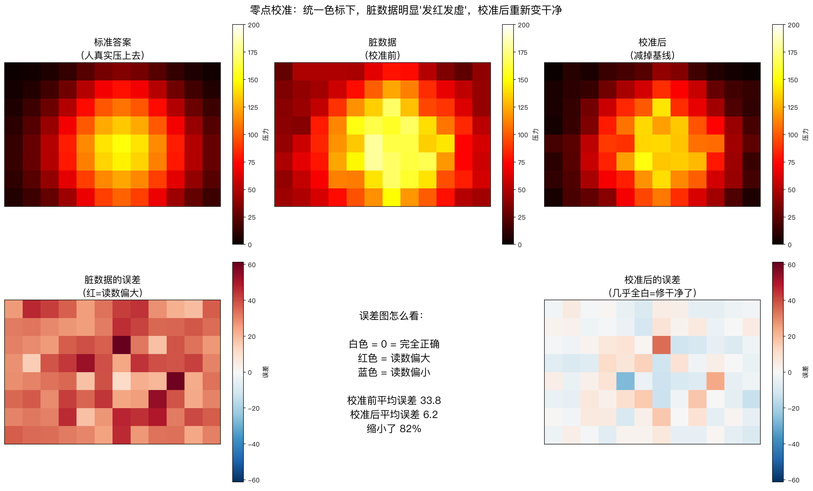
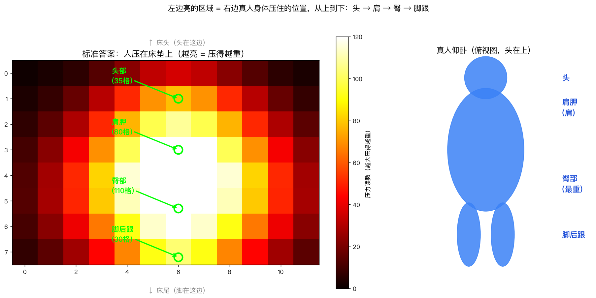

# PressureLab


> A no-hardware playground for flexible pressure-sensor simulation, calibration & edge deployment.
>
> 一张**离线 AI 医疗床**的软件起步包：没有真硬件，先用数学「演」出柔性压力传感器的脏数据，再演示怎么把它校准干净。

<p align="center">
  
</p>

## 📖 目录

- [🎯 这是什么](#-这是什么)
- [🚀 快速开始](#-快速开始)
- [🧪 跑测试](#-跑测试)
- [🧩 四个脚本](#-四个脚本)
- [🩺 传感器五种毛病](#-传感器五种毛病)
- [📊 示例输出](#-示例输出)
- [🗺️ 路线图](#️-路线图)
- [📁 目录结构](#-目录结构)
- [📚 致谢与引用](#-致谢与引用)
- [📄 License](#-license)

## 🎯 这是什么

这张床的核心，是床垫下的一排**柔性压力传感器**。但真正让团队翻车的，往往不是 AI 模型，而是**传感器会骗人**：它会温漂、会零点漂移、会「记仇」（迟滞）、同一批货灵敏度还不一样。不先把这些毛病校准掉，AI 学到的全是假规律。

这个仓库把「没硬件也能开工」的部分先做出来，共四样东西：

| 脚本 | 干什么 |
|---|---|
| `src/pressure_simulator.py` | 用高斯鼓包模拟人躺上去的体压图，再叠加 5 种传感器毛病，输出「标准答案 vs 脏数据」 |
| `src/zero_calibration.py` | 演示第一招校准——零点归零（一个减法），把平均误差砍掉 80% 以上 |
| `src/body_shape_proof.py` | 证明模拟出来的人形不是随机的，并标注头 / 肩 / 臀 / 脚跟位置 |
| `src/main_controller.py` | 边缘主控程序骨架：采集线程 → 队列 → 推理线程，含断线重连 + 看门狗 |

## 🚀 快速开始

```bash
# 1. 装依赖（只需要 numpy + matplotlib）
pip install -r requirements.txt

# 2. 跑传感器模拟器，生成「标准答案 + 脏数据」
python src/pressure_simulator.py

# 3. 跑零点校准演示，看脏数据被修干净
python src/zero_calibration.py

# 4. 看人形证明图
python src/body_shape_proof.py
```

跑完的图会生成在 `outputs/` 目录里。

## 🧪 跑测试

```bash
# 装测试依赖
pip install -r requirements-dev.txt

# 跑全部测试（18 个）
pytest tests/ -v
```

测试覆盖四个脚本的核心逻辑，保证「摆好的人形」「校准有效」「迟滞现象」这些关键性质不会在改动中被悄悄破坏。

## 🩺 传感器有五种「毛病」（这个项目真正的敌人）

| 毛病 | 大白话 | 怎么修 |
|---|---|---|
| 批次不一致 | 同一批货，每个点灵敏度差 15% | 逐个标定（增益校准） |
| 温漂 | 天热天冷，基线整体偏移 | 温度补偿 |
| 零点漂移 | 用久了，没人压读数也自己飘 | 离床自动归零 |
| 串扰 | 压 A 点，隔壁 B 点也读到了 | 串扰校正 |
| 噪声 | 信号里随机抖动 | 滤波 |

<p align="center">
  
</p>

## 📊 示例输出

零点校准的效果：一个减法，把平均误差从 33.8 降到 6.2（缩小 82%）。

<p align="center">
  
</p>

## 🗺️ 路线图

- [x] 传感器模拟器（高斯体压 + 5 种毛病）
- [x] 零点校准（减法）
- [x] 边缘主控骨架（采集 → 推理 → 报警，含断线重连 + 看门狗）
- [x] 测试套件 + CI
- [ ] 更真实的人体模拟（肩比头宽、两腿分开、侧卧/俯卧）
- [ ] 增益校准（除法，修灵敏度不一）
- [ ] 温度补偿、串扰校正
- [ ] 接入公开压力阵列数据集（PoPu-Data）
- [ ] 睡姿分类模型
- [ ] PSG 预训练 → 床垫数据迁移（对标 BCGNet）

## 📁 目录结构

```
.
├── src/                      # 所有代码
│   ├── sensor_config.py      # 集中配置（所有参数 + 公共函数，改一次三处生效）
│   ├── main_controller.py    # 边缘主控骨架
│   ├── pressure_simulator.py # 传感器模拟器
│   ├── zero_calibration.py   # 零点校准演示
│   └── body_shape_proof.py   # 人形证明图
├── tests/                    # 测试套件（pytest）
├── assets/                   # README 用的示例图
├── examples/                 # 示例输出（标准答案 + 脏数据）
├── .github/workflows/        # CI 自动跑测试
├── requirements.txt          # 运行依赖
├── requirements-dev.txt      # 测试依赖
├── CITATION.cff              # 学术引用格式
└── LICENSE
```

## 📚 致谢与引用

这个项目站在这些公开资源的肩膀上：

- [PoPu-Data](https://github.com/rdionisio1403/PoPu) — 床垫上下两层压力阵列公开数据集（CC0，可商用）
- [BCGNet](https://github.com/FiveSeasonsMedical/BCGNet) — 「海量 PSG 预训练 → 床垫数据微调迁移」的思路来源
- [Stanford-STAGES](https://github.com/Stanford-STAGES/stanford-stages) — 自动睡眠分期的参考实现

### 引用

如果你在研究中用到了这个项目，请这样引用：

```bibtex
@misc{pressurelab,
  author = {{PressureLab Contributors}},
  title = {PressureLab: A No-Hardware Playground for Pressure-Sensor Simulation and Calibration},
  year = {2026},
  url = {https://github.com/<your-name>/<repo-name>}
}
```

## 📄 License

[MIT](./LICENSE)
