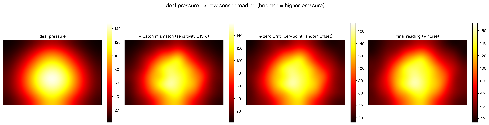
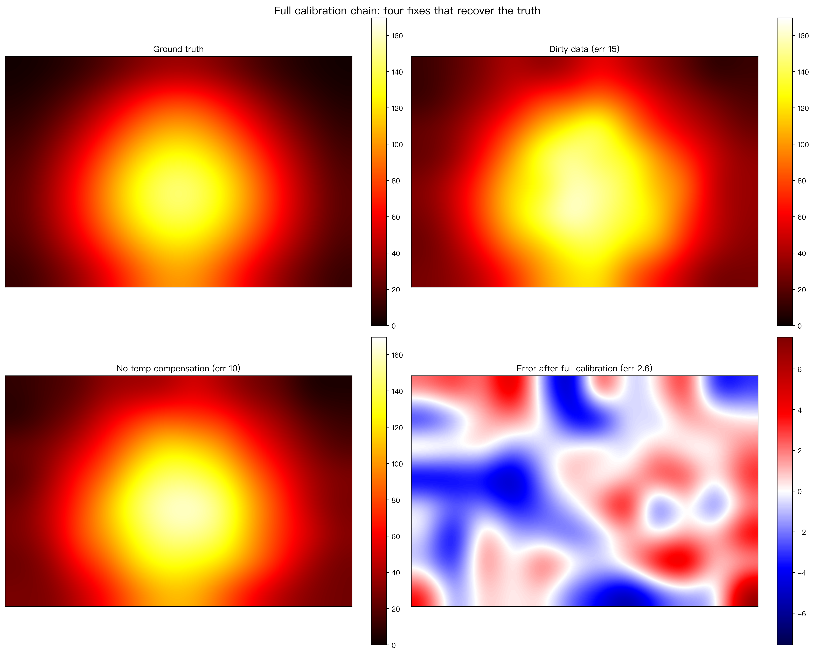
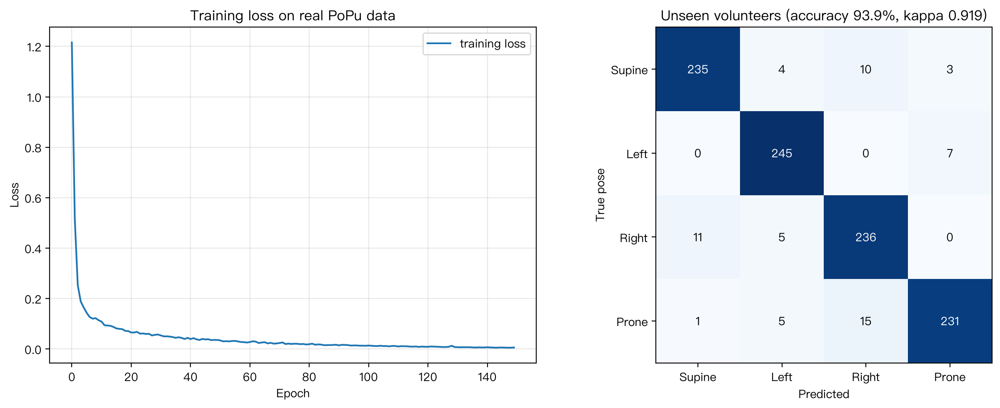
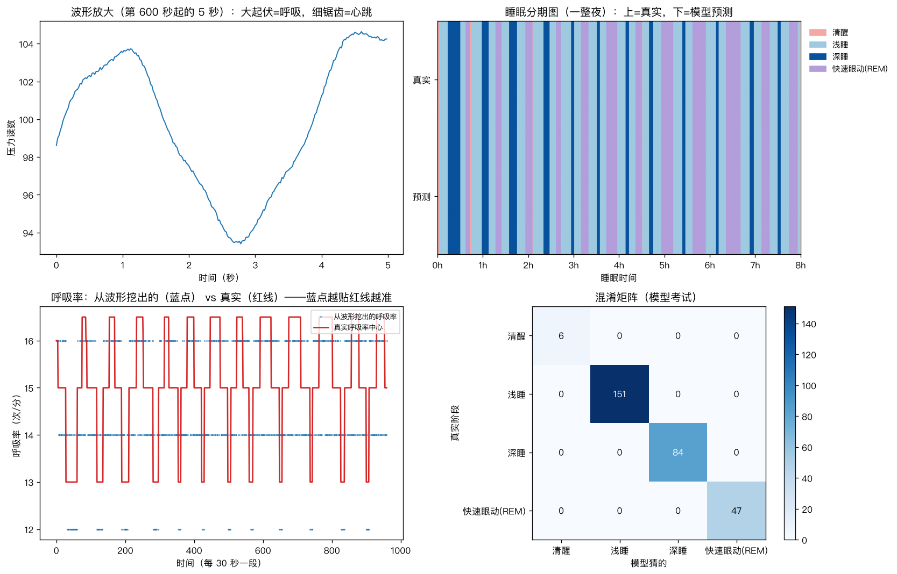

# PressureLab

> [English](README.md)

> ⚠️ **本项目仅供研究与教学使用。**
> 这是算法研究演示，**不是医疗器械**，不能用于临床诊断、监护或任何医疗决策。
> 所有报警逻辑（离床、呼吸暂停、压疮风险）均基于**合成数据**演示，**未经过临床验证**。
> 公开数据集上的准确率不代表真实临床性能。

[](https://github.com/banzaicolo/PressureLab/actions)


**一张床垫，读懂睡眠。不穿戴、不摄像、不上云。**

一个**无需硬件即可开发**的柔性压力传感器床垫平台：用数学「演」出脏传感器数据 → 用完整标定链洗干净 → 做出首批应用（睡姿、离床、呼吸/心跳、睡眠分期）→ 最终**接入真实公开数据训练**。睡姿分类器对**从未见过的陌生人**达到 **93.9% 准确率**（PoPu 数据集，60 位真人）。每个环节都带测试。



*模拟器生成的五种传感器毛病——下游所有模块都必须扛得住这些脏数据。*

## 模块一览

| 模块 | 入口 | 作用 |
|---|---|---|
| 传感器模拟器 | `pressure_simulator.py` | 高斯体压图 + 5 种传感器毛病 |
| 标定流水线 | `calibration.py` | 串扰、温漂、零点、增益、迟滞 |
| 睡姿分类器 | `train_pose_classifier.py` | 纯 NumPy 手写神经网络（仰卧 / 侧卧 / 俯卧） |
| 离床监测 | `bed_monitor.py` | 总压力状态机 + 「超时未归」报警 |
| BCG 呼吸/心跳 | `bcg_monitor.py` | FFT 提取呼吸率、心率 + 呼吸暂停检测 |
| 睡眠分期 | `sleep_staging_demo.py` | 四分类（清醒 / 浅睡 / 深睡 / REM） |
| 端到端链路 | `sleep_pipeline_demo.py` | 原始 BCG 波形 → 5 特征 → 睡眠分期 |
| 真实数据读取器 | `pupu_loader.py` | PoPu JSON → 校准后的压力图（去掉零点偏移） |
| 真实数据训练 | `train_real_pose.py` | 60 位真人 × 4 种睡姿分类：**陌生人准确率 93.9%** |
| 边缘主控 | `main_controller.py` | 多线程骨架（采集 → 推理 → 报警） |



*完整标定链：串扰 → 温漂 → 零点 → 增益 → 迟滞。*

## 快速开始

```bash
pip install -r requirements.txt

python src/pressure_simulator.py       # 模拟脏传感器数据
python src/calibration_demo.py         # 完整标定流水线
python src/train_pose_classifier.py    # 训练睡姿分类器
python src/bed_monitor_demo.py         # 离床监测
python src/bcg_demo.py                 # 呼吸/心跳 + 呼吸暂停
python src/sleep_staging_demo.py       # 睡眠分期（睡眠结构图）
python src/sleep_pipeline_demo.py      # 完整链路：波形 → 特征 → 分期
python src/download_pupu.py full       # 下载真实数据（82 MB，只需一次）
python src/pupu_demo.py                # 可视化真实压力图
python src/train_real_pose.py          # 真实数据训练：陌生人准确率 93.9%
```

图片输出到 `outputs/`。

## 测试

```bash
pip install -r requirements-dev.txt
pytest     # 130 个测试
```

## 数据：合成 vs 真实

多数演示跑在**合成信号**上——用数学生成「标准答案」来证明算法逻辑正确，**不代表真实性能**。

**睡姿分类器额外接入了真实数据训练**（[PoPu-Data](https://github.com/rdionisio1403/PoPu)，CC0 许可：60 位真人、约 5 万帧真实床垫压力图），并诚实报告两个分数：

| 评估方式 | 准确率 | 含义 |
|---|---|---|
| 随机切分 | 98.3% | 模型部分「见过本人」——有水分 |
| **按人切分** | **93.9%** | 考试者从未在训练中出现——**真实的部署性能** |

（4 类：仰卧 / 左侧卧 / 右侧卧 / 俯卧；陌生人考试 Cohen's κ = 0.919。）



*左：训练损失下降。右：12 位从未在训练中出现的陌生人的混淆矩阵。*

PoPu 从官方仓库下载：**github.com/rdionisio1403/PoPu**（CC0 许可，随便用、可商用）。

下载（脚本已内置在仓库里）：

```bash
python src/download_pupu.py preview   # 2.6 MB — 先验证流程
python src/download_pupu.py full      # 82 MB — 真正训练用
```

> 诚实说明：**全世界没有任何公开数据集，是「同一个人躺着，同时采床垫压力 + 脑电睡眠标注」的配对数据。** Sleep-EDF 是脑电，无法直接训练床垫模型。这份配对数据正是本项目要自建的壁垒（PSG 预训练 → 床垫微调，对标 BCGNet）。



*完整链路：原始 BCG 波形 → 5 特征 → 睡眠分期。*

## 路线图

- [x] 传感器模拟器 + 5 种毛病模型
- [x] 完整标定链（串扰 / 温漂 / 零点 / 增益 / 迟滞）
- [x] 睡姿分类器（纯 NumPy 神经网络）
- [x] 离床监测
- [x] BCG 呼吸/心跳（呼吸暂停检测）
- [x] 睡眠分期
- [x] 端到端链路（原始波形 → 特征 → 分期）
- [x] 用 PoPu 真实压力数据训练（**陌生人准确率 93.9%**，4 种睡姿）
- [ ] 硬件在环标定
- [ ] PSG 预训练 → 床垫微调（对标 BCGNet）

## 数据与隐私

本项目默认**离线运行**——不上云，数据不出房间。

真实部署时，床垫压力信号属于**敏感个人健康数据**，运营方必须遵守适用法规（中国《个人信息保护法》、欧盟 GDPR 等）。本仓库**不含任何可识别的受试者数据**。训练用的 PoPu-Data 数据集为 CC0（公有领域），且**未在本仓库二次分发**——请用 `src/download_pupu.py` 从官方源获取。

## 许可证

[MIT](LICENSE)

## 引用

见 [CITATION.cff](CITATION.cff)。
